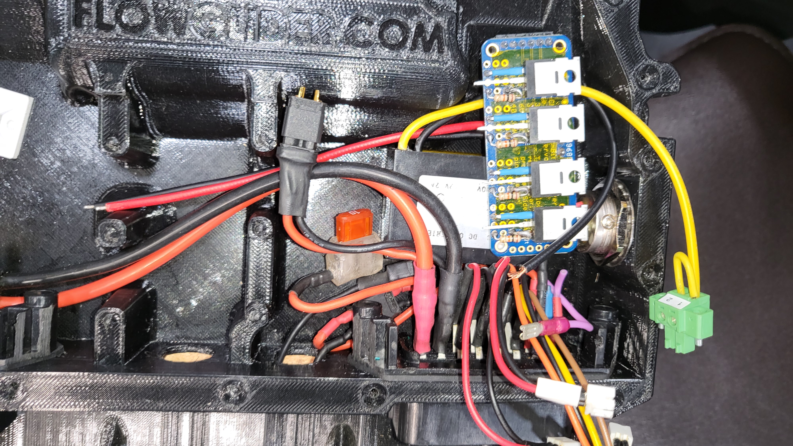
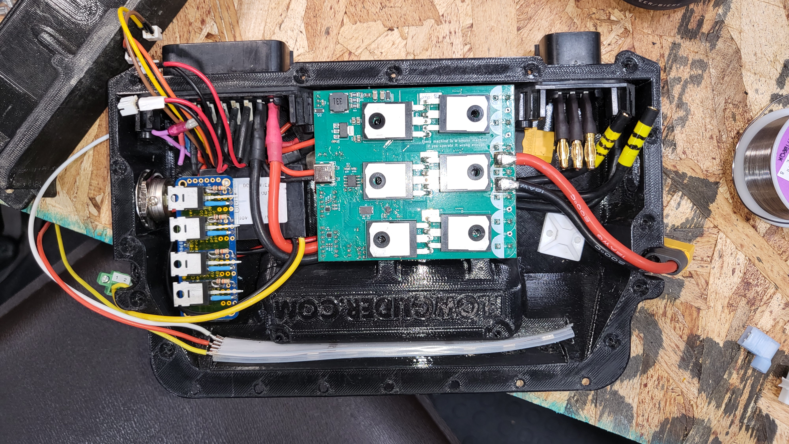
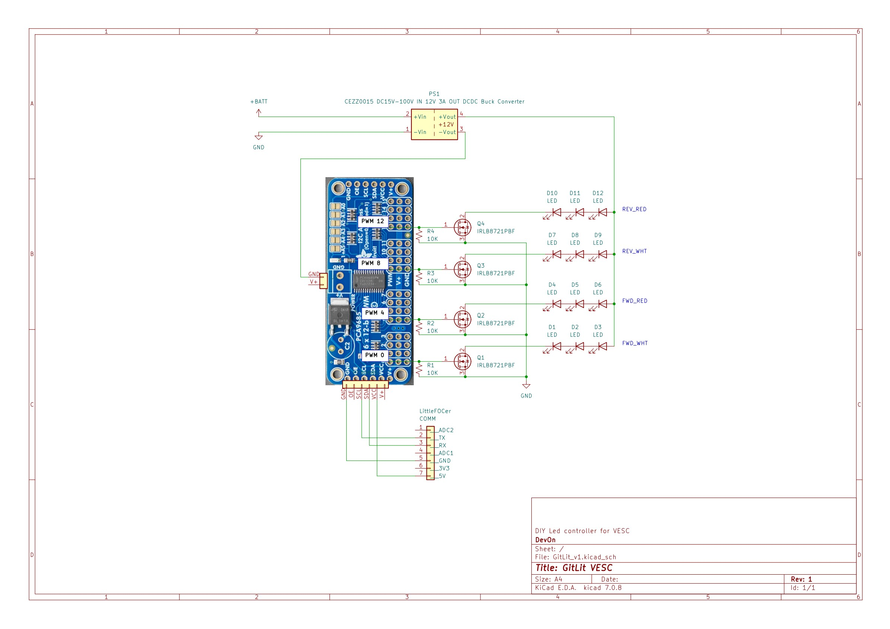

# GitLit Package

## By Devon Piecuch

This is an LED controller specifically developed for VESC OneWheeled boards using the Float Package available in the official Packages Store. It uses the lib_pca9685 driver to communicate over I2C with the PCA9685 PWM controller.

## FEATURES

- 4 channel control over the leds (Typically red/white forward/backward)
- Directional switching of channels
- Smooth color transitions
- Switching delay
- Full control of on/off and dimming level through the VESC mobile app
- Storing of on/off state and dimming level in Flash memory
- Battery SOC light logic on startup
- Hard braking led blink

## Dependencies:

- Float Package downloaded in Packages archive (installed or not doesn’t matter) 
- Lib_pca9685 

## Build Materials:

- PCA9685 16-channel, 12-bit PWM Fm+ I2C-bus LED controller [https://www.adafruit.com/product/815](https://www.adafruit.com/product/815)
- N-Channel Power MOSFET (30V / 60A) [https://www.adafruit.com/product/355](https://www.adafruit.com/product/355)
- 10K Ω resistor
- Analog RGBW LED Strip - RGB plus Cool White - 60 LED/m 1m (~6000K) [https://www.adafruit.com/product/2594](https://www.adafruit.com/product/2594)
- DC15V-100V to 12V 3A DC DC Converter Step Down Voltage Regulator [https://www.aliexpress.com/i/3256804935916237.html?gatewayAdapt=4itemAdapt](https://www.aliexpress.com/i/3256804935916237.html?gatewayAdapt=4itemAdapt)

## Build Photos:

## Functions

***\*WIP***

